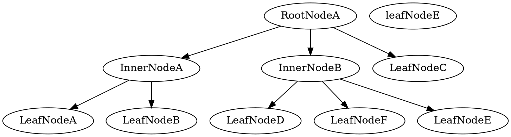

# `text2flow`

> Live text to flowcharts converter
> Purposes of creation: documenting Lithography project

## Project Requirements

## What You Type is What It Draw

### Samples

#### Phase 1a. Trees

* RootNodeA
	* InnerNodeA
		* LeafNodeA
		* LeafNodeB
    * LeafNodeC
    * InnerNodeB
    	* LeafNodeD
    	* LeafNodeE
    	* LeafNodeF

##### How it could be done in

> **GraphViz**


    
    


> **draw.io** (visual approach)


#### Phase 1b. FlowSpec

#### Phase 1c. Backlinks

#### Phase 1d. Decoration

### Internal Grammar Schema

> Grammar Schema should be implemented only in the second phase of development since it require more efforts.

```scala
digit = /[0_9]/
symbol = /[a_zA_Z]/
decorative-delimiter = {
	'-' | '+' | '=' | '/' | '\\' | '&' | '*' | \
    '.' | '(' | ')' | '[' | ']' | '{' | '}' | \
    '!' | '@' | '#' | '$' | '%' | '^' | '_' | \
    ':' | '?' | '<' | '>' | ',' | '~'
}
guarding-open-delimiter = '"' | '{' | '['
guarding-close-delimiter = '"' | '{' | '}'
inner-char = digit | symbol | decorative-delimiter
backslashed-guardian-delimiter = '\"'
string = guarding-delimiter ~ (inner-char | backslashed-guardian-delimiter) ~ guardian-delimiter
indent = '\t'
// TODO: complete Grammar Schema
```
